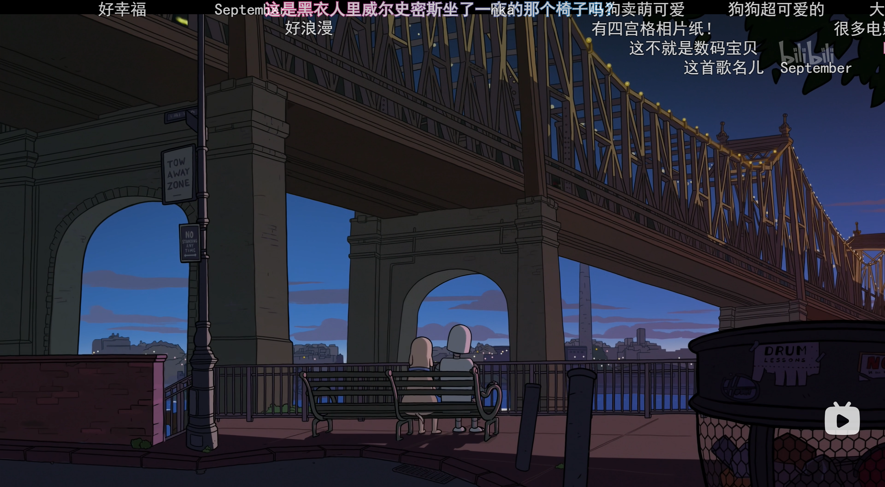
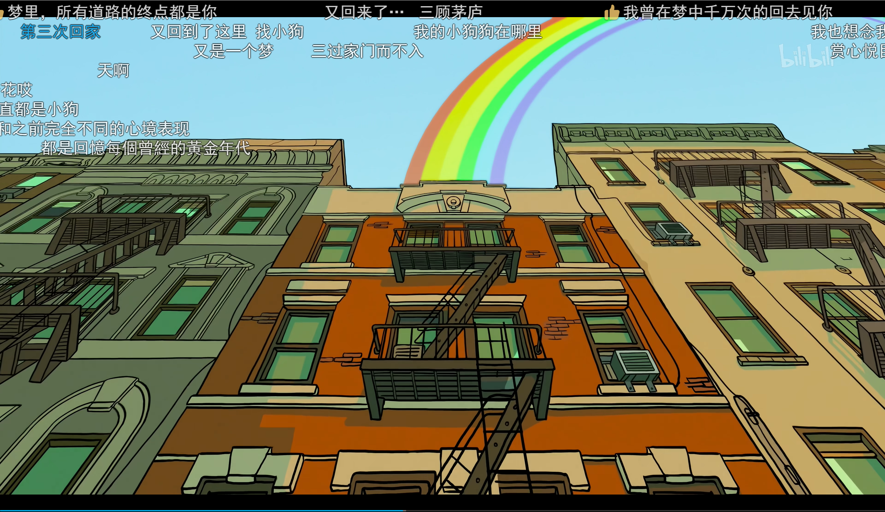
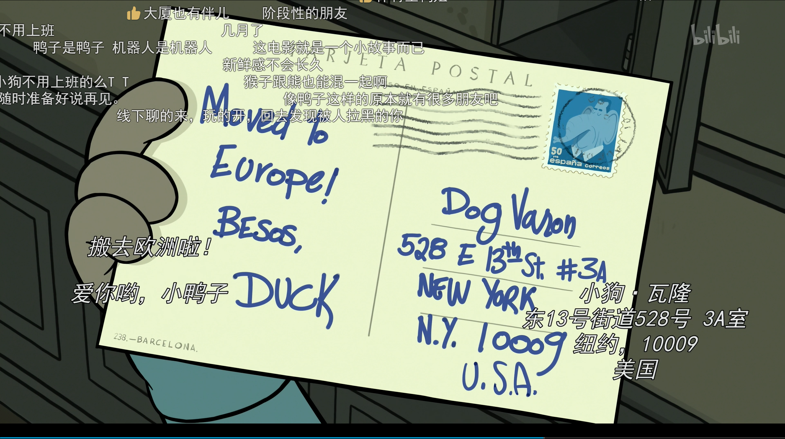
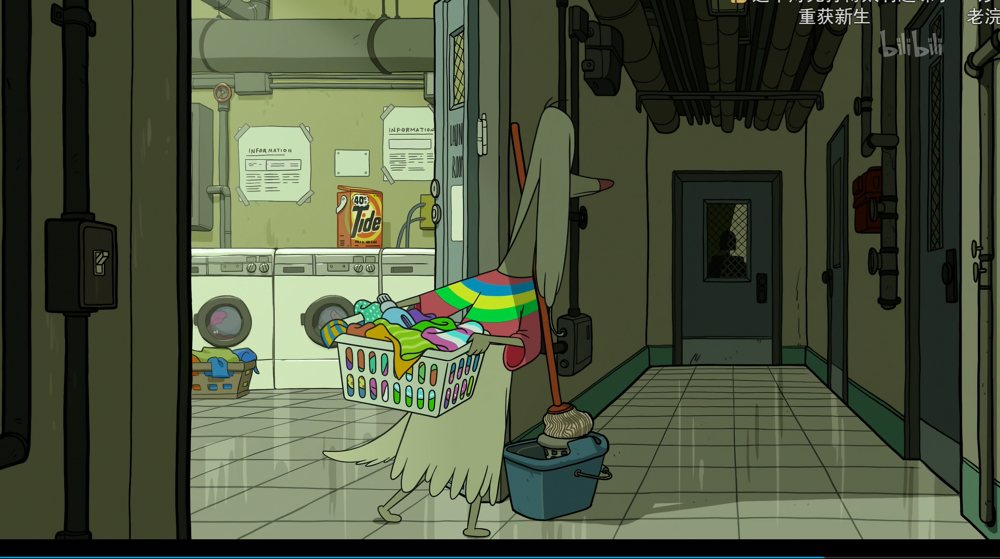

> 第一幕1：47
>
> 
>
> 主人公一个人在玩游戏
>
> 
>
> 从冰箱拿出速冻食品一个人吃饭打开电视
>
> 看到外面亲密的人感到羡慕
>
> 电视弹出机器人伙伴的广告
>
> 
>
> 4:19第一幕结束

> 
>
> 开始组装机器人
>
> 装好后发现没有安装电池
>
> 
>
> 机器人对人的感情还很不了解（这个时候遇到后面的浣熊）
>
> 
>
> 两个人美好的经历，一起听音乐跳舞september 
>
> 
>
> 回收前面小狗一个人玩游戏的伏笔
>
> 
>
> 第一次出现桥
>
> 
>
> 机器人开始出现变化，前面因为陌生好奇产生的兴奋开始衰退
>
> 
>
> 即将高潮，机器人不懂保护自己，小狗也不知道要为机器人考虑
>
> 
>
> 生锈的广告，可能和后面机器人的梦有关系，里面也有一只小猫
>
> 
>
> 开始变化
>
> 
>
> 机器人生锈无法动弹，机器人示意小狗先走

> 第三幕，机器人损坏
>
> 
>
> 小狗失眠，早上时间到了就想要去修好机器人
>
> 
>
> 游乐园关门，但是机器人还在里面动不了,小狗尝试去救机器人
>
> 
>
> 
>
> 被保安赶走，通过合法途径申请
>
> 
>
> 
>
> 尝试敲门进去呗逮捕
>
> 
>
> 
>
> 
>
> 机器人之梦第一梦，梦到被兔子救了以后回到小狗家，梦醒发现腿被兔子打断了
>
> 
>
> 小狗恍惚间看到机器人但是什么都没有
>
> 
>
> 机器人第二梦，梦到狗子已经有了新的机器人
>
> 
>
> 机器人回到游乐园看着自己
>
> 
>
> 小狗去滑雪的路上想起机器人
>
> 
>
> 机器人的第三梦，第四面墙
>
> 
>
> 
>
> 爱丽丝梦游仙境，第三梦清醒
>
> 
>
> 小狗做梦梦到雪人，看到雪人其实是机器人以后惊醒
>
> 
>
> 机器人认识小鸟一家，小鸟一家离开
>
> 
>
> 小狗认识鸭子，mark六月要救机器人回来
>
> 
>
> 
>
> 和鸭子钓鱼因为可怜鱼把鱼放生
>
> 
>
> 鸭子离开，小狗尝试改变陷入低谷
>
> 
>
> 机器人被捡走卖到废品厂
>
> 
>
> 小狗终于可以来沙滩但是机器人已经不在这里了一小时四十八分
>
> 

> 第四幕，小狗和机器人都开始新的生活
>
> 
>
> 机器人被浣熊捡走改造
>
> 
>
> 小狗买了新的机器人
>
> 
>
> 机器人开始新生活
>
> 
>
> 机器人学会了控制自己
>
> 
>
> 这个时候小狗也和新机器人在一起

场景回到沙滩

> 
>
> 小狗学会了关心别人
>
> 

> 第五幕，机器人看到了小狗
>
> 机器人的第四梦,自己追上去
>
> 
>
> 清醒
>
> 
>
> 
>
> 选择不追上去,在窗口放认识时候的音乐
>
> 
>
> 小狗意识到机器人，但是机器人没有出来见他
>
> 
>
> 
>
> 结束
>
> 